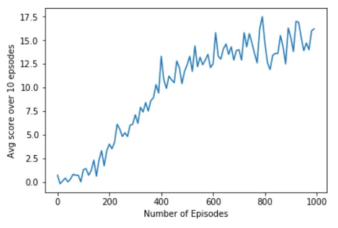

# **Collecting Bananas** 

---

A project to collect yellow bananas and avoid blue ones in a unity environment.

---

## Project Reflections

### Learning Algorithm

This project implements a Double Deep Q-Network (DDQN) with Experience Replay in order to maximize the agents reward and solve the environment. 

The paper describing the DDQN architecture can be found [here](https://arxiv.org/abs/1509.06461).

My implementation of DDQN uses:

* Two 3-layer fully connected networks, Qθ and Qθbar, which map the environment state to possible actions
* Adam optimization with 5e-4 learning rate
* A batch size of 64 for batch learning
* Replay buffer size of 1e5
* Epsilon with a start of 1 and end 0.01 and decay of 0.995
* A discount rate gamma of 0.99

In brief, my implementation follows these steps to solve the environment:

* Initialize Neural Networks with random weights
* For each frame in 300 frame episode:
  * forward prop state through Qθ, and use current epsilon to either randomly pick action or pick action with max value from network.
  * take action on environment, retrieve next_state, reward, and done flag
  * store experience tuple of (state, action, reward, next_state, done)
  * Every 4 frames if the replay buffer has reached batch size of 64:
      * Sample random set of 64 experiences and for each experience:
          * Use Qθ and Qθbar to determine q-value for best action of next state
          * Calculate TD target as experience reward + (gamma * that q-value)
          * Calculate current q-value of current state and action with Qθ
          * Use MSE loss between TD target and current to backprop on Qθ
      * Move weights of Qθbar closer to Qθ (soft_update)
  * Repeat until solved

### Current Performance

Below you can see that this approach reaches 13 points after ~500 episodes, and then begins to level out around 17 points.

### Possible Improvements

There have been many advances in DQNs that could be integrated into this including priortized experience replay to select better samples, dueling dqn to better estimate q-values, or a combination of those and other with a RAINBOW like architecture. 